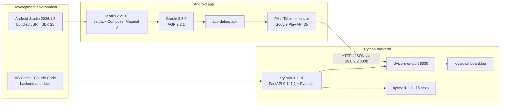
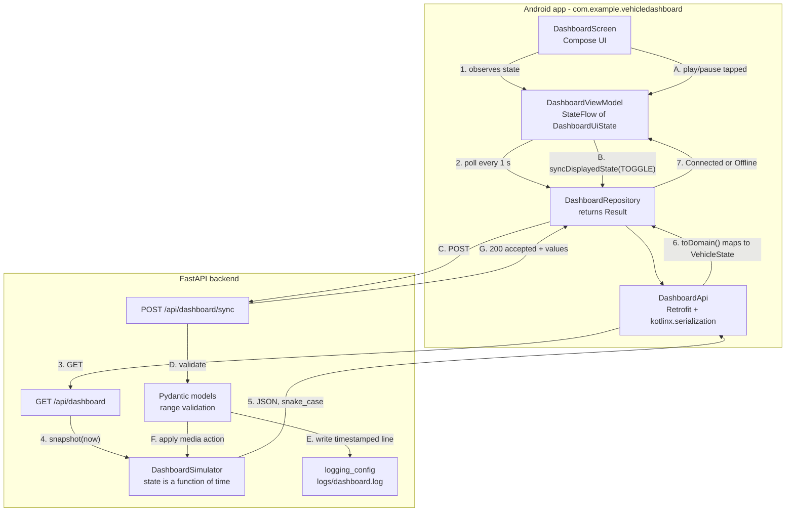

# Architecture Overview

Two diagrams: the tools used to build the system, and the system itself.

---

## A. Toolchain

---

## B. Software architecture and data flow

**GET polling flow (1–7).** The backend simulates; the app displays. Steps 1–7
repeat about once per second. The UI never sees JSON field names — `toDomain()`
at step 6 is the only place they exist.

**POST action flow (A–G).** The play/pause button does not flip a local flag. It
reports the action, the backend validates it, logs it with a timestamp, and
applies it to the simulation — so the change arrives back through the normal GET
poll at most one second later. One source of truth, and the log entry is proof
the round trip happened.

---

## Layer responsibilities

| Layer | File(s) | Rule it follows |
|---|---|---|
| UI | `ui/DashboardScreen.kt`, `ui/components/*` | Reads state, reports clicks. No logic. |
| Presentation | `ui/DashboardViewModel.kt`, `ui/DashboardUiState.kt` | Owns the polling loop and the three states. Survives rotation. |
| Data | `data/DashboardRepository.kt` | Hides the data source. Converts failures into values, never throws at the UI. |
| Transport | `data/remote/*` | Retrofit contract, DTOs, and the single DTO→domain mapping. |
| Domain | `domain/VehicleState.kt` | Types the UI can trust: enums and `Instant`, not strings. |
| Simulation | `app/simulator.py` | The only source of vehicle data in the whole system. |
| Contract | `app/models.py` | Ranges from the assignment, enforced by Pydantic. |
| Logging | `app/logging_config.py` | Timestamped, UTC, one JSON object per line. |

The `docs/` folder also contains the UI reference mock-ups that guided the visual
design. They are design references only and are not used as assets in the app.
